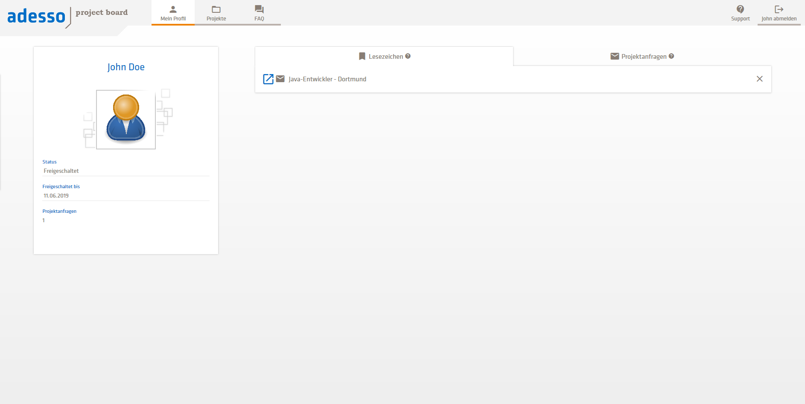
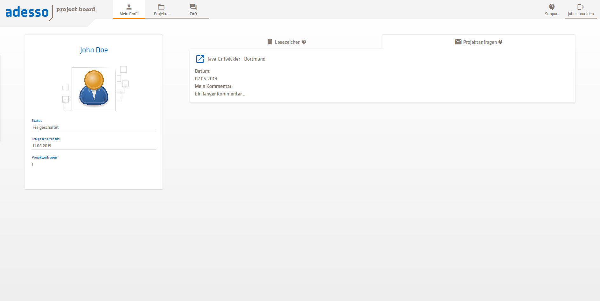
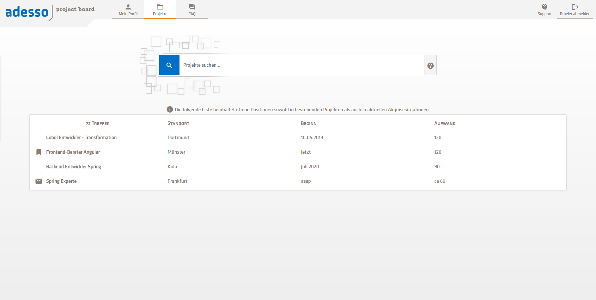
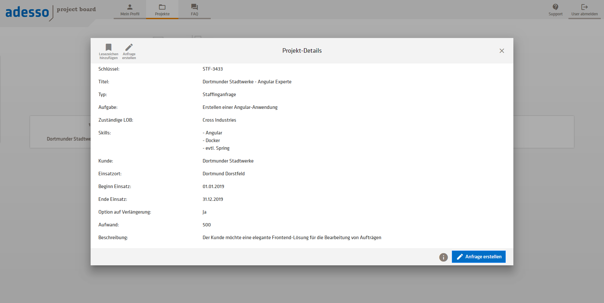
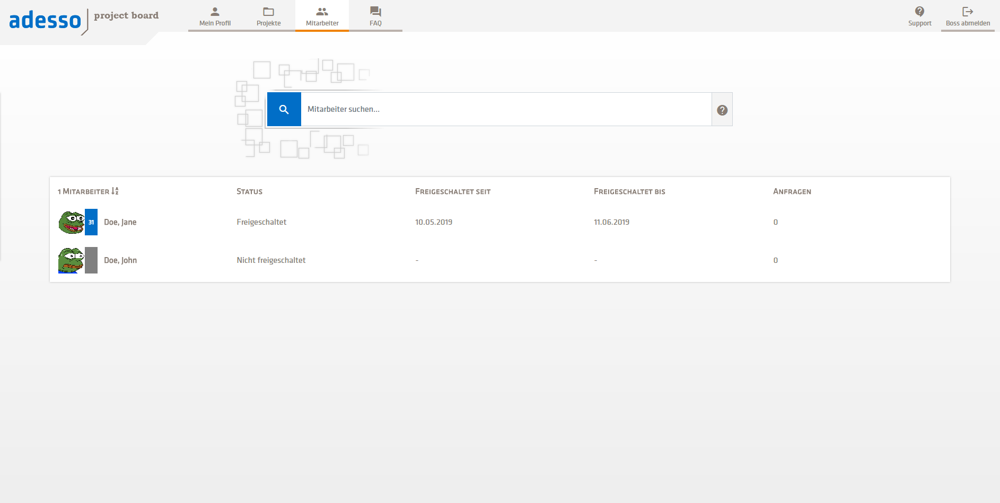
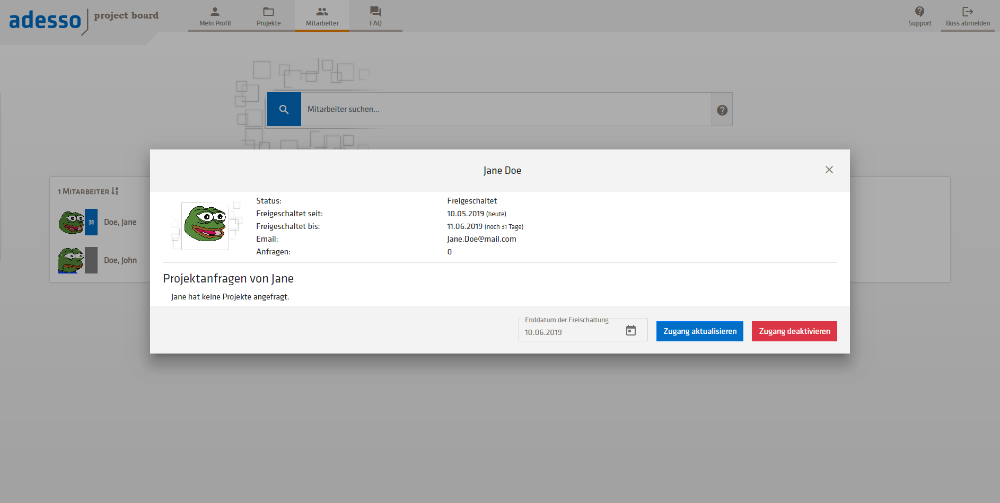

# Project Board
A web-based bulletin board for open positions in projects. Staff members can browse projects and apply for interesting ones.

Currently in development.

## Screenshots

### User Profile

The User profile shows basic information about your bookmarked projects and projects you applied for, as well as your current access status.

### Projects Tab

The project list shows a list of all projects matching your current search query.

Clicking on a single project shows a detailed view of the project. This is where you can apply for a project.

### Staff Tab (Managers only)

The staff list shows a list of all direct staff members of the current user. Staff members of a direct staff member are displayed after clicking a little dropdown arrow.

Clicking on a single user shows you a detailed view of the selected user. This is where you can give access to specific users.

## REST API Documentation

REST Interface documentation can be found [here](https://documenter.getpostman.com/view/3900854/RWgrydjn).
